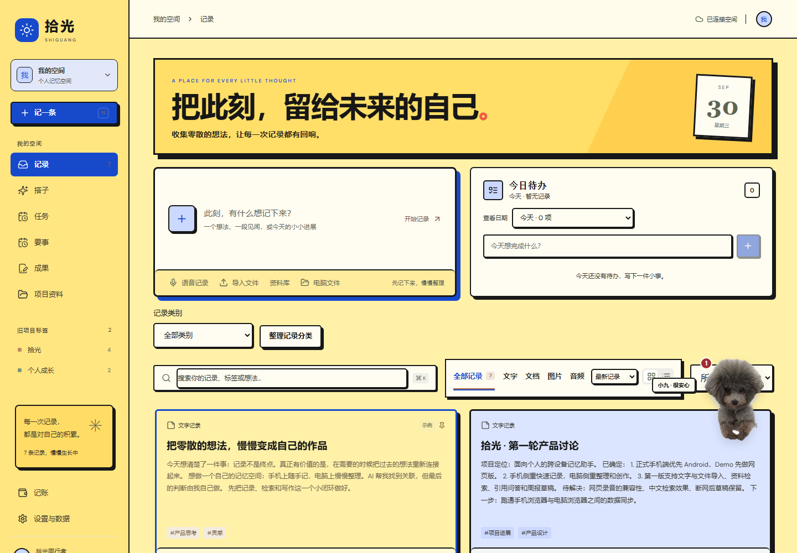
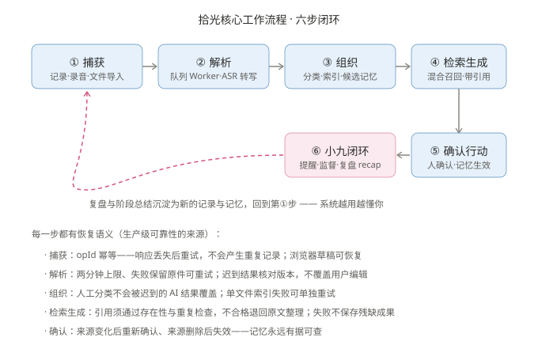
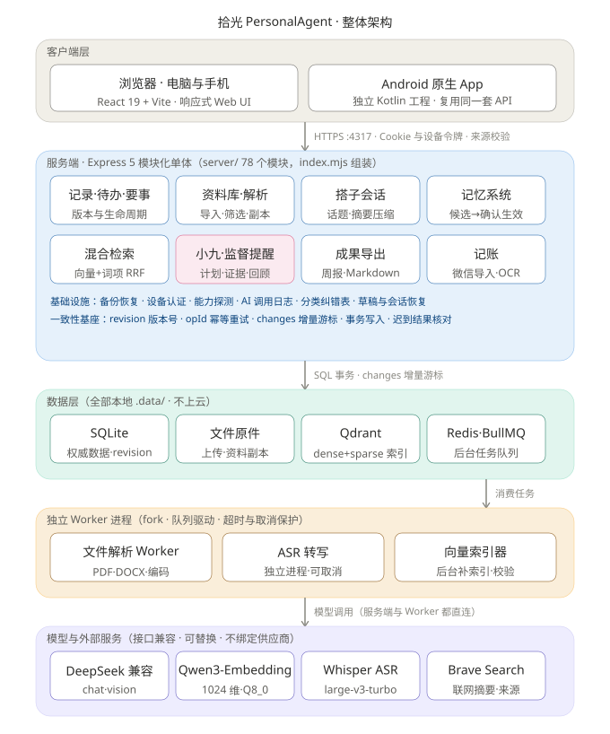
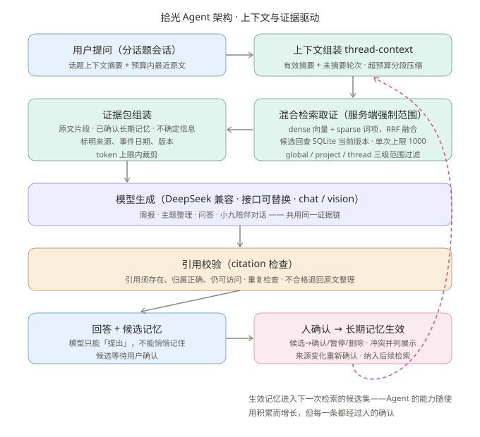

# 拾光 · PersonalAgent

一个手机和电脑共用的个人记忆空间：随手记录，找回资料，把积累整理成新的成果——还有一只会提醒你、陪你复盘的桌宠「小九」。

## 1. 项目简介

**它是什么**：一个单用户、本地优先的个人 Agent Web 应用。记录零散想法、资料和待办，AI 自动分类、总结、建立内容关联；支持关键词 + 向量混合检索、带引用的智能问答、重点信息提取和待办整理，并能根据已有内容生成阶段总结与后续行动建议。

**解决的痛点**：

- 想法、文件、语音、待办散落在各处，记了就忘、找不回来；
- 通用笔记工具只负责"存"，不负责"理"——没有自动分类、没有跨内容关联、没有阶段性回顾；
- 个人工具最大的死因不是功能不够，而是**弃用**——没有人推你一把，用两周就荒废了。

**价值与特色**：

- **记忆层**：第二大脑。资料、长期记忆、混合检索（向量 + 词项 + RRF 融合），SQLite 为唯一权威数据源，数据全部本地、不上云；
- **行动层**：外置的执行监督。待办、要事、监督任务带条件快照与证据链，形成可审计的执行闭环；
- **陪伴层**：桌宠小九——原型是朋友家真实存在的宠物，类似《魔法少女樱》中小可的精灵定位。她提醒、监督、引导你坚持使用，是系统唯一的"主动交互界面"（规划以 Electron 桌面壳常驻，见第 7 节）；
- **可靠性**：贯穿全系统的一致性语义（revision 版本 / opId 幂等 / 增量游标 / 迟到结果核对），响应丢失可重试不重复、失败不保存残稿、AI 引用不实宁可退回原文。

## 2. 核心功能

| 功能 | 说明 |
|---|---|
| 记录与待办 | 新增/修改/删除/置顶、标签与项目筛选、中文检索、草稿恢复；待办按天管理，未完成可移入今天 |
| 资料库导入 | TXT/MD/CSV/JSON、文字层 PDF、DOCX；图片音频保留原件可补充正文；电脑端可浏览导入已映射的 E 盘 |
| 语音 | 浏览器前台录音 + 本地 Whisper 转写（可取消/重试/逐段修订），转写后 AI 归纳 |
| 自动分类 | 保存后 AI 自动单分类；人工分类不会被迟到的 AI 覆盖；分类纠错反馈表 |
| 智能问答（搭子） | 带来源引用；分话题会话、跨天继续、话题摘要压缩；可引用已有记录按"判断/依据/风险/下一步"分析 |
| 混合检索 | Qdrant dense + sparse 双路召回、RRF 融合，服务端强制项目/范围过滤，候选回查 SQLite 当前版本 |
| 记忆系统 | 候选记忆 → 用户确认 → 生效；来源变化重新确认、来源删除失效；模型只能"提出"，不能悄悄记住 |
| 周报与成果 | 阶段总结、主题整理、成果编辑与 Markdown 导出；生成失败不保存残稿 |
| 小九 | 10 种心情状态机、陪伴聊天（带记忆上下文）、提醒面板聚合四类待处理事项、任务监督与复盘 |
| 记账 | 微信账单导入（去重）、账单截图 OCR、AI 分类建议、月度预算 |
| 安全与备份 | 访问口令、会话隔离、设备令牌；完整备份/隔离验证恢复 |

**效果展示**：

<p align="center">
  
</p>
<p align="center"><sub>电脑端 · 资料库</sub></p>

## 3. 项目结构

```text
PersonalAgent/
├── src/                # 前端 React 19 + TypeScript（63 个组件）
│   ├── PetBuddy.tsx        # 小九桌宠：心情状态机、聊天、提醒面板
│   ├── Library*.tsx        # 资料库：清单、详情、筛选、批量操作
│   ├── Assistant.tsx       # 搭子会话（智能问答）
│   └── Memories.tsx / Events.tsx / TodoPanel.tsx ...
├── server/             # 后端 Express 5 模块化单体（78 个模块）
│   ├── index.mjs           # 组装入口：路由与模块挂载
│   ├── store.mjs           # SQLite 权威数据层（revision/事务/游标）
│   ├── engine.mjs          # AI 引擎：摘要/标签/问答/成果生成
│   ├── retrieval*.mjs      # Qdrant 混合检索（dense+sparse+RRF）
│   ├── pet-*.mjs / supervision-*.mjs   # 小九：提醒聚合 + 任务监督
│   └── memory-*.mjs / library-*.mjs / event-*.mjs ...
├── mobile/ → 已分离     # Android 原生工程已独立为同级的 ../personalagent-android（Kotlin，复用同一套 API）
├── docs/               # 设计文档：产品、架构、验收、需求澄清
│   └── diagrams/           # 架构图与流程图（本 README 配图来源）
├── scripts/            # 启动/备份/嵌入索引/ASR/检索基准脚本
├── tests/              # 接口测试 + Playwright e2e（双尺寸）+ 无障碍
└── .data/              # 本地数据（SQLite、文件原件、日志；不入 Git）
```

**核心目录**：`src/`（前端）、`server/`（后端，一切业务逻辑所在）、`docs/`（设计决策的完整记录）。Android 原生工程在同级的 `../personalagent-android`，设计文档随迁至其 `docs/mobile/`，后端 `/api/mobile/v1/*` 路由保留在本项目中。

## 4. 核心工作流程

一条记录从进门到被小九提醒处理的完整旅程——六步闭环，每一步都有恢复语义：

<p align="center">
  
</p>

**核心步骤注释**：

1. **捕获**——多入口（记录/录音/文件导入/E 盘），先存原件和 SQLite 版本再谈解析；opId 保证响应丢失后重试不重复；
2. **解析**——Redis/BullMQ 队列 + fork 独立 Worker（PDF/DOCX/ASR），两分钟上限，失败保留原件，迟到结果核对版本不覆盖用户编辑；
3. **组织**——AI 自动分类 + Qdrant 双路索引 + 提出候选记忆；人工分类不被 AI 覆盖；
4. **检索与生成**——混合召回 + 范围过滤 + 候选回查当前版本；引用不实退回原文，失败不存残稿；
5. **确认与行动**——人始终在环上：候选记忆确认生效、要事检查确认、待办升级为监督任务；
6. **小九闭环**——提醒聚合（四类待处理）引导处理，证据与计时，最后形成阶段回顾（recap），沉淀为新的记录与记忆，**回到第 1 步**。

## 5. 项目架构设计

### 5.1 整体架构

<p align="center">
  
</p>

三个关键设计决策：

- **SQLite 是唯一权威数据源**，Qdrant/Redis 都是可重建的衍生物——检索服务挂了、队列丢了，数据不丢；
- **模型层接口兼容、可替换**——DeepSeek 只是当前默认，chat/vision/embedding/ASR 全走适配层，不绑定供应商；适配层后续将由 pi-agent 统一接管（见第 7 节演进方向）；
- **一致性基座贯穿所有模块**——revision 版本号、opId 幂等、changes 增量游标，"迟到结果不覆盖新数据"是全系统语义。

### 5.2 Agent 架构

Agent 链路的核心是**上下文与证据驱动**：回答不是"模型直接说"，而是"带着你的资料、经过校验地说"：

<p align="center">
  
</p>

要点：

- **取证在先**：服务端先确定项目/日期/范围，客户端不能覆盖授权范围；混合检索的结果回查 SQLite 当前版本，过期候选不进证据包；
- **引用校验在后**：模型生成的每个引用须存在、归属正确、仍可访问，不合格退回原文整理——不把"AI 说的"冒充"资料里有的"；
- **记忆闭环**：模型只能提出候选记忆，经人确认才生效；生效记忆进入下一次检索的候选集——Agent 能力随使用积累增长，但每一条都经过人的确认。

## 6. 功能模块设计

| 模块 | 设计要点 |
|---|---|
| 记录/待办/要事 | 统一 revision 版本模型；要事带生命周期（约定检查→复核建议→用户确认）与证据图片关联 |
| 资料库 | 独立副本不动原文件；解析在独立 Worker（2 分钟上限）；相同内容共享副本但各来源保留独立版本 |
| 搭子会话 | 话题制：摘要 + 预算内原文组装上下文，超长按角色分段压缩；发送带操作标识，刷新可恢复 |
| 记忆系统 | 候选→active→superseded/expired 生命周期；多来源证据；矛盾并列展示请用户裁决 |
| 混合检索 | dense + sparse 双路召回 RRF 融合；编辑/删除/暂停后同步更新索引；可按单文件重试 |
| 小九（表现层） | 事件驱动心情状态机（HOVER/PET/CHAT/TIMEOUT/过度互动），纯前端、轻量 |
| 小九（服务层） | pet-reminders 聚合要事检查/今日待办/记忆确认/监督逾期，免打扰、按来源去重；supervision 系统的 workTask 模板→每日 workRun 执行，条件快照保证"模板改动不影响已约定的历史" |
| 记账 | 微信 xlsx 导入按 sourceRef 去重；截图 OCR 视觉模型识别；AI 分类建议仅是建议 |
| 备份恢复 | 完整备份（SQLite+原件+成果）哈希校验；隔离验证不替换当前空间 |

## 7. 演进方向

已确定的技术演进决策（部分进行中）：

- **接入层重构（进行中）**：模型适配器（chat/vision/embedding/ASR）将由管理后台导入的 **pi-agent** 统一接管，各供应商 adapter 收口到一处维护，Web 端只面对统一接入层；
- **多端协议共享**：API 协议 Schema 抽取为**独立模块**，桌面端 / Web 端 / Android 端通过 **Git Submodule** 依赖同一份 Schema——协议版本集中管理，多端不漂移；
- **语义化 API 版本**：请求路径统一带 `/v1/` 版本前缀，协议大变更时新旧版本可并行过渡，避免多端同步混乱；
- **小九常驻桌面（规划）**：基于 Electron 将现有 Web 前端包装为桌面壳，透明窗口 + 系统托盘，小九常驻桌面——关掉浏览器后她仍在，情绪状态机与业务引擎保持解耦。
