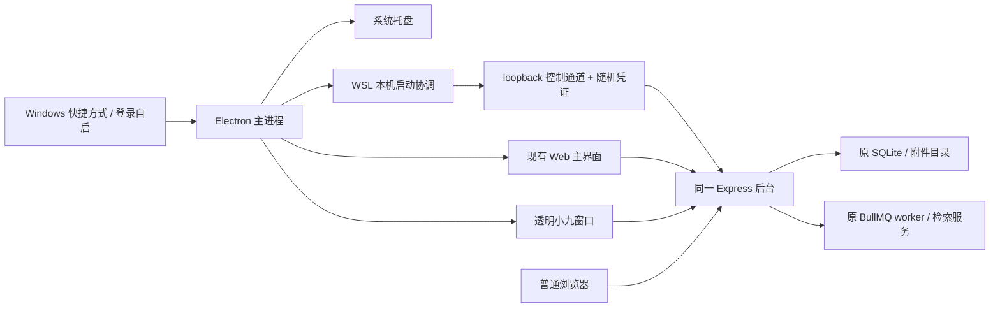
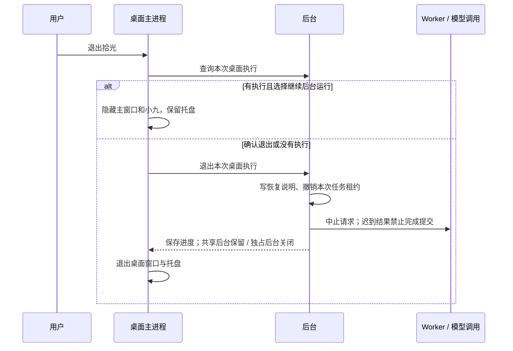

# 桌面小九实施与使用

更新：2026-10-09。对应架构评审 §9.4；本轮模型只使用现有 DeepSeek flash，不扩展其他模型，不开发手机端。

## 使用

- Windows 桌面快捷方式：**拾光小九**。普通双击打开主界面和独立小九窗口；首次进入仍使用原空间口令（演示口令可用）。
- 关闭主界面只隐藏窗口，小九和后台继续运行。小九下方「打开主界面」、托盘「打开拾光主界面」恢复同一个窗口。
- 小九继续提供摸摸、拖动、hover 提示表、交流、汇报、提示语常驻。点击提示会把主窗口带到对应业务来源；导航不会确认提醒。
- 首次正式启动默认登记 Windows 登录自启；自启参数为 `--autostart`，只创建小九窗口。「设置与数据 → 桌面小九」可关闭。
- 托盘「退出拾光」才是完全退出。有本次桌面发起的在途请求/已到期后台执行时，可选继续后台运行或确认退出；没有执行则直接退出。
- 设置页和启动失败页可打开桌面日志、后台日志；失败页可重试。

## 安装范围

这是 Windows 原生 Electron 壳，连接本机 WSL 内现有 PersonalAgent。不是把 WSL 中的 Node 窗口当作 Windows 桌面，也不另建桌面数据库。目前交付的是这台电脑的运行时目录与快捷方式，不是可在任意新电脑无依赖安装的发行包。

```bash
# 在已经可用的 WSL 项目中安装/更新；不复制个人资料或模型密钥
npm run build
python3 scripts/install-desktop.py
```

安装目录为 `.local-runtime/xiaojiu-desktop/44.7.0`；Windows 也可运行 `scripts/start-desktop.ps1`。安装脚本从 Electron 官方发布下载，并校验 SHA-256。运行时、本机路径配置、业务数据不提交 Git。程序沿用当前 WSL 发行版、Node 24 路径及本项目目录；移动项目或更新 Node 安装位置后重新运行安装脚本。

首次正式启动会设置登录自启。以后覆盖更新桌面脚本保留用户的自启选择、登录与窗口位置。安装脚本需当前 Windows 用户、WSL 和 PowerShell 可用；没有额外收费模型调用。

## 实现与服务归属



- `desktop/main.mjs` 管窗口、托盘、进程协调和自启；受限 `preload.cjs` 只暴露具体动作。Renderer 不拿 Node、文件路径执行权或本机控制凭证。
- `scripts/desktop-backend.mjs` 校验真实项目路径、数据目录、控制协议版本、随机实例身份与 HTTP 健康响应；端口被占用但身份不明时显示错误，不杀未知进程、不另开数据库。
- 后台控制通道只绑定 loopback，使用 `.data/desktop-runtime.json` 内随机凭证。它是进程管理 IPC，不新增面向各客户端的业务 HTTP 接口；业务协议保持 contracts v0.3.0，156 个操作、159 个 Schema。
- 后台未启动时，协调器准备现有 Redis、已安装的 Qdrant 和已选择的本地 Qwen embedding，再启动原 API/worker。缺失或失败的可选服务保留现有能力状态提示/降级，不改为其他聊天模型。
- 后台原来就存在：退出桌面保留它。桌面自己启动且可确认独占：才关闭 API/worker。一旦普通浏览器或其他客户端访问过，当前进程生命周期内保守视为共享；无法确认时保留。
- Redis、Qdrant、embedding 属于共享基础服务，不随桌面退出批量杀进程。异常退出遗留的后台也保守复用，不追认成新桌面独占。

## 退出与保存边界



- 请求上下文记录本次桌面来源；后台作业入队时记录来源所有权。停止只作用于本次来源的在途请求与已到期作业，不取消网页任务，也不删除未来约定提醒。
- Pi 模型调用与搭子循环接收取消信号；队列撤销租约后拒绝迟到提交。任务保留失败/停止说明及已有结果，搭子保留已取得来源和中途回答。不会把未完成执行标成完成。
- 后台作业取消信号在租约心跳检查时传播。不能撤销供应商已经接收/计费的请求，也不承诺外部工具都能断点恢复；不支持取消的外部步骤可能收尾后才释放资源，但失效租约不能提交成功。
- 下次启动，小九托盘提示上次执行需要继续；原任务及搭子会话保留重试/继续入口。确认退出不会自动追加模型预算。
- 主窗口关闭不是取消操作；没有停止当前任务的副作用。

## 数据与界面刷新

共用原后台和数据库。记录列表沿用 4 秒变更游标检查、焦点刷新；小九提示沿用游标失效刷新和周期读取。已有编辑 revision 检查继续生效，外部修改不会替用户强行覆盖未保存编辑。各独立页面保留原有加载/刷新规则；没有声称所有页面都已改成 WebSocket 实时推送。

## 本轮必要验证

- TypeScript / Vite 构建通过；仍有原有约 783 KB 主包大小提示。
- 协议检查通过，业务契约未改变。
- 3 条本机运行时检查：旧/共享后台保留；仅独占归属可关闭；仅本人到期任务取消、未来提醒和他人任务保留、迟到结果不能提交。
- Windows 原生 Electron 检查：双窗口连接同一后台、演示登录共享、小九提示表可见且在窗口内、关闭主窗口只隐藏、小九按钮恢复且不重复开窗、桌面设置入口、退出仍保留原 Web 后台。测试没有发起模型请求或改动业务记录。
- 单独按 `--autostart` 启动核对仅显示小九；没有重启用户电脑验证完整 Windows 登录过程。
- 实测发现图片覆盖打开主界面按钮，已约束图片尺寸并复查通过。

## 后续范围

签名安装包、自动升级、无 WSL 的后端发行包尚未交付；本轮不扩张到这些内容。其他模型、手机端和 skill/studio 编辑器仍不在本轮范围内。

实现依据：[Electron 安全指南](https://www.electronjs.org/docs/latest/tutorial/security)、[自启接口](https://www.electronjs.org/docs/latest/api/app#appsetloginitemsettingssettings-macos-windows)、[窗口鼠标穿透](https://www.electronjs.org/docs/latest/api/base-window#winsetignoremouseeventsignore-options)。


## 2026-10-09 · 全屏移动修复

原实现将小九固定在 490×720 透明窗口右下角，并把整窗限制在工作区，造成角色只能在屏幕下方/右侧移动。现在以小九本体的屏幕坐标定位，透明宿主与窗口内角色位置共同调整，可到达整个桌面可用区域；仅保留防止角色和打开按钮移出屏幕的边界。提示表根据上下空间选择展开方向，超长内容仍可滚动。保存角色位置，兼容旧窗口位置设置；聚焦角色后也可使用方向键移动，Shift 加速。

针对性验证：坐标边界检查（含负坐标显示器）、Windows 原生窗口四角移动、四角提示表可见、方向键移动与重启恢复位置通过；未调用模型或修改业务记录。更新已复制到本机运行时，旧桌面进程需从托盘「退出拾光」后重新打开；只关闭主窗口不会更新桌面进程。
