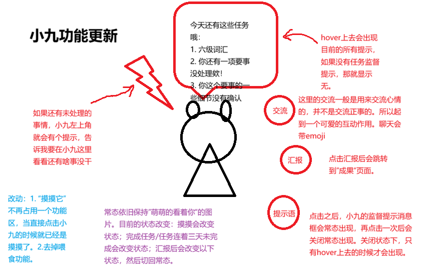

# 小九桌宠 spec

版本：2026-09-28 · PET · 网页端与服务端 · 根据用户最新示意图和补充要求修订。

对应 [plan](小九桌宠plan.md) 与 [总索引](README.md)。本文件是开发目标，尚未据此修改应用。最新要求覆盖旧版“仅维护轻陪伴、不接业务提醒”的限制。

## 1. 目标与责任

小九同时是生活情绪交流的陪伴者和**全应用统一的监督、督促与提醒表达入口**。一切提醒、监督相关提示都与小九绑定，由小九说出，并汇总到 hover 时可见的独立提示表。

业务模块决定事实、时间和完成条件；小九负责说出来、集中展示和带用户到处理位置。不是每个页面另做一套独立催促，也不是把监督职责交给“交流”聊天随意判断。

## 2. 需求依据与现状

用户确认：

- 有未处理事项，小九左上角出现提示标识。
- hover 到小九，显示当前所有提醒/督促提示组成的提示表；没有提示显示“无”。
- 「提示语」按钮切换提示表常驻；关闭常驻后仍可 hover 查看。
- 「交流」用于生活和心情交流，不作为正事处理入口；聊天带 emoji。
- 「汇报」点击跳转「成果」页面，同时触发小九状态变化，随后回到常态。
- 直接点击小九即摸摸，不再独立占一个“摸摸它”功能区；去掉喂食功能。
- 常态保留现有“萌萌地看着你”的图；摸摸、完成任务、任务连续三天未完成、汇报会引起状态变化。
- 最新补充明确：**所有提醒和监督提示都绑定小九，由小九说出**，不只接任务模块的部分消息。

现有 `src/PetBuddy.tsx` 有浮层、拖动、情绪素材、摸摸、喂食及短聊天，`POST /api/pet/chat` 提供短历史聊天。目前尚无全局提示表与统一业务提醒契约。不得把这次文档更新写成已实现。

## 3. 用户流程与布局

### 常态与入口

保留当前小九形象和可拖动能力，常态使用现有萌萌看着用户的素材（核对 `assets/小九-端正坐好萌萌地看着你.png`）。围绕角色提供「交流」「汇报」「提示语」三个功能入口。图表达交互关系，不要求机械照搬圆圈、红色批注或示意位置。

直接单击角色触发摸摸反馈，不自动打开交流。拖动结束不误触摸摸。未处理提示存在时，左上角标识可见；标识消失由业务事项处理状态决定，不由“看过消息”决定。

### 提示表：hover 与常驻

1. hover 角色或其提示标识，打开**小九提示表**；移到提示表内仍可滚动和操作，不因离开角色几像素就关闭。
2. 提示表按项列出当前所有有效提示。条目多时内部滚动或完整分页，不能只显示前几条而隐藏其余；可分组，但不能拆成无法统一回看的独立消息框。
3. 点「提示语」打开常驻模式，鼠标离开仍显示；再次点击关闭常驻，恢复仅 hover 时显示。
4. 关闭常驻后若鼠标仍在角色/提示表上，按 hover 规则仍可暂时显示；离开后关闭，不把此行为误判为开关失效。
5. 无有效提示时显示“无”；加载中和获取失败分别显示对应状态，不能把失败说成无事项。
6. 键盘聚焦可查看并操作提示，提供关闭临时展示的方式；不会操作 hover 的用户也可通过「提示语」固定查看。具体按钮保持可辨认标签，不只靠颜色。

### 交流与汇报

- 「交流」打开小九情绪聊天，语气自然可爱、短句适量 emoji；倾听优先，不把每次倾诉都变成任务盘问。
- 聊天气泡与业务提示表分开管理。聊天回复不能覆盖提示表、清空提醒或伪造任务状态。
- 「汇报」直接导航到成果页（当前 `#artifacts`），不是点击后偷偷生成报告、提交证据或确认任务完成。触发短暂汇报反馈后回到常态。
- 提示表条目可带“查看/去处理”入口，按源模块打开具体待办、执行实例、要事或其他处理页；不需要用户在聊天里复述事项。

## 4. 全局提醒契约

### 提示来源与所有权

| 来源 | 应接入小九的提醒 | 处理的事实来源 |
| --- | --- | --- |
| SUP / ACT | 开始、到期、跟进、稍后检查、等待用户资料/验收等待处理提示 | workTask/workRun、条件、证据及调度记录 |
| EVT | 到期待确认、稍后确认、高等级复核建议及需处理的复核失败 | event 的等级、dueAt、review 与确认状态 |
| REC | 当日未完成待办；已有明确约定的成果/报告提交提醒 | todo、已存在的任务/证据约定，不凭空给所有草稿设截止 |
| MEM 等模块 | 已产生且需要用户处理的记忆确认/冲突等提示 | 原候选与冲突状态，不替用户选择 |
| 其他及后续模块 | 已定义的业务提醒、监督消息 | 源模块契约；包含后续记账的查看账单提醒，记账规则以用户文档为准 |

普通保存成功 toast、表单校验、网络连接错误不是督促提醒，不必都变成小九台词；它们仍就近显示。若错误导致约定任务等待用户处理，则对应的待处理提示进入小九。原模块的历史、状态、操作按钮可以保留，但不独立再发一轮催促；原地需要呈现督促内容时，同样使用统一消息并明确是小九的提示。

### 目标数据结构

统一提示模型是目标契约，建议字段：`id, sourceKind, sourceId, sourceRevision, occurrenceKey, category, title, message, dueAt, createdAt, updatedAt, status, actionTarget, severity`。`message` 是小九台词；保存事实引用及去重键，不能只保存脱离源对象的字符串。

- 调度由源模块负责，小九不再创建第二套计时器来重发相同提醒。
- 服务端按已登录空间聚合，状态从权威业务数据计算或同步；标识与提示表使用同一数据源。
- `occurrenceKey` 区分一次约定中的开始/到期/跟进；同一提示重复轮询不新增。已解决、取消或失效条目退出当前表；历史仍在源模块。
- 已查看不等于已处理；收起、取消常驻、摸摸和聊天都不确认事项。
- 稍后提醒、安静时段和到期条件沿用源模块。休眠中的提醒不继续作为活跃催促；若保留在表中，明确分组为“已安排稍后”，不点亮待处理标识、不重复催促。
- 从其他页面完成待办或确认要事后，小九及时更新。服务重启恢复提示状态，不把旧提示全作为新提醒刷出。

### 谁生成小九台词

提醒事实、数量、日期和状态由程序与业务库确定，不能交给模型猜测。优先用稳定的小九口吻模板，如“今天还有这些事等你处理哦：……”。可选 AI 润色只改变语气，失败回退模板；查看 hover 表不触发一次模型请求。无需语音合成，“由小九说出”本轮指文字台词。

聊天模型使用小九聊天内容与短历史，并可按 Q10 读取与当前交流相关、已确认有效的通用长期记忆。**小九展示层读取业务提醒是已确认需求，不等于允许将全量任务、要事、记忆或财务数据送入情绪聊天模型。**聊天与提醒上下文分别管理，页面说明准确描述这一区别。

## 5. 状态与情绪反馈

| 触发 | 小九行为 | 业务副作用 |
| --- | --- | --- |
| 常态 | 萌萌地看着用户 | 无 |
| 直接点击角色 | 摸摸反馈/状态变化 | 不处理提醒，不开启正事聊天 |
| 用户完成任务 | 可爱的完成反馈 | 仅消费已确认完成事件，不代为完成 |
| 同一每日任务连续三天未完成 | 温和关心/督促状态，并给有依据的提示 | 不诊断、不羞辱、不自动补记/改期 |
| 点击汇报 | 汇报反馈，跳成果页，随后回常态 | 不生成/提交/确认任何产物 |

实现默认（图未指定的细节，非既有行为）：三天按 Asia/Shanghai 下同一每日任务三个连续、已过截止的完整计划日判断；今天尚未到截止不算。跳过、取消和明确改期不直接当失败；暂停/无计划日不拼接成连续三天。待验收与已明确未完成分开表达，避免把缺确认直接说成“你没做”。阈值事实由 SUP 提供，小九只消费结果，不能从页面访问频次猜测。

反馈状态与“是否有待处理提醒”独立：汇报反馈结束回常态也不清除提醒标识。短暂反馈的时长和素材映射属于实现默认，优先复用现有资产；新事件可替换旧反馈，旧定时器不能把更新状态错误覆盖。未完成状态的重复提示遵守 SUP 跟进上限，刷新页面不重复播一遍。

## 6. 功能要求

| 编号 | 要求 |
| --- | --- |
| PET-01 | 保留角色、拖动和可操作布局；提供「交流」「汇报」「提示语」，直接点击即摸摸，移除独立摸摸区与喂食入口/调用。 |
| PET-02 | 小九统一承载全应用提醒与监督台词；只读聚合源模块事实，不重复调度、确认或修改业务数据。 |
| PET-03 | 左上角待处理标识与提示表来自同一数据；hover 展示全部当前提示，无提示显示“无”，加载/失败不得冒充空，加载失败需要附带简单原因。 |
| PET-04 | 「提示语」切换常驻；关闭后恢复 hover；提示表可进入、滚动、操作且支持键盘，长内容不被截断。 |
| PET-05 | 「交流」主要交流生活心情，短句和 emoji；聊天上下文与业务提示数据分离，失败保留草稿。 |
| PET-06 | 「汇报」仅跳成果页并触发短暂状态变化后回常态，不隐式生成报告、提交证据或确认完成。 |
| PET-07 | 摸摸、实际任务完成、连续三天未完成和汇报驱动状态；事实来自业务源，状态反馈与提醒显隐独立。 |
| PET-08 | 处理/改期/稍后/取消/跨日/服务重启后提示同步、去重；保留人工确认、安静时段及跟进上限。 |
| PET-09 | 小九台词可在无生成模型时正常显示；不因 hover/轮询调用模型，不把提示表全量注入情绪聊天。 |
| PET-10 | 情绪交流可按 MEM 规则载入相关、已确认的通用长期记忆；候选、过期、暂停和项目专属内容不默认读取。 |
| PET-11 | 有效待处理记忆候选点亮红点；确认或五轮过期后同步更新，不重复逐轮催促。 |

## 7. 验收标准

| 编号 | 场景 | 通过条件 |
| --- | --- | --- |
| PET-A01 | 入口变更 | 点击角色只触发摸摸，拖动不误触；独立“摸摸它”和喂食已移除，三入口可用。 |
| PET-A02 | 提示表与标识 | 同时存在每日任务、待办、要事及候选确认，统一表全部可查且为小九台词；无提示显示“无”，服务失败有错误状态。 |
| PET-A03 | hover/常驻 | hover可打开并移入表滚动；点提示语后移走仍在，再点恢复hover；键盘可操作，关闭表不等于处理消息。 |
| PET-A04 | 全局唯一表达 | 开始/截止/跟进、要事提醒和后续模块提醒走同一小九契约，不出现另一套独立催促；源页面操作仍可使用。 |
| PET-A05 | 业务状态同步 | 在源页面完成、确认、改期、稍后或取消后，小九对应更新；重复轮询/重启不重复提醒，不越过人工确认门槛。 |
| PET-A06 | 情绪状态 | 任务真实完成触发反馈；构造三个合格未完成日触发关心，未到期/跳过/改期不误算；旧定时器不覆盖新状态。 |
| PET-A07 | 汇报 | 点击即到成果页、短暂反馈后回常态；没有新增 artifact、证据提交或完成确认，未处理标识仍保留。 |
| PET-A08 | 交流与隔离 | 心情交流自然带适量emoji；失败保留输入，提示表不被聊天覆盖；请求不自动带入全部业务资料或写 active 记忆。 |
| PET-A09 | 负载与可用性 | 无模型时仍能看真实提醒；多条长提示不溢出/不遮挡主操作；hover及轮询无模型调用。 |
| PET-A10 | 通用记忆与红点 | 相关已确认通用记忆可用于交流，失效/候选不可用；第五轮候选过期后红点与完整提示表一致更新，旧回包不复活提示。 |

## 8. 依赖与非目标

SUP 提供任务监督事实和三日状态；EVT 提供到期、复核及确认状态；REC 提供待办/成果入口；MEM 等提供已定义的待处理提示；SET 提供会话、错误及公共配置。小九是表达层，不取代这些模块的权威数据。

本轮不做系统级桌宠、语音播报、跨设备情绪聊天记忆或让聊天模型自动执行任务。业务提醒接入已确认，不再放在 P2。记账原文不改，后续实现提醒时接入本契约。

## 过滤与校验补充（2026-09-29）

遵守 [校验审查中的共同契约](../14-filter-validation-review.md)：候选、已选与可提交使用一致规则；无效已选项必须可见可移除；模型建议不等于有效业务数据。以下是目标约束，不代表代码已修复。

- **V01：** 模型返回值先校验对象结构、类型、长度、枚举及引用。标题/摘要/分类等业务内容超限不能无提示截断；无效必填字段显示具体原因。模型不能写 priority、confirmed、active、revision 等人工/服务端字段。关联建议可过滤去重，但必须返回被移除项的原因；用户已确认输入不能静默过滤。
- **V02：** 候选列表、已选列表和提交校验共用类型/空间/状态/自身排除规则；候选缺页不代表对象失效。已有选项即使不在当前页，也须显示摘要或失效占位及移除入口。提交时重新核验，失败保留草稿，按字段及具体 ID 返回原因。
- **V21：** 标识、列表、总数从同一有效性谓词/一致快照派生；分页含总数和快照版本。稍后/过期/已处理的归属明确；旧响应不能覆盖新处理状态，入口按来源类型解析。仅关闭/摸摸/汇报不调用确认接口。

## Q09/Q10 已确认：记忆红点与交流连续性

小九可以使用相关、已确认的通用长期记忆帮助情绪交流；不是全量注入业务资料，也不自动读取项目/话题专属记忆。经 MEM 统一 active/范围/来源/版本过滤，暂停或失效立即排除；记录实际采用的记忆。沿用人工记忆确认，不新增自动激活入口。

未处理记忆候选作为小九统一待处理事实点亮红点；五轮过期按 MEM 计数规则同步移除提示，不把每轮都变成新的催促。来源模块可以显示同一待确认状态，不能另起一轮独立催促。

## 桌面版追加决策（2026-10-08，已确认，待实施）

术语澄清（2026-10-08，用户确认）：以下“桌面版”指复用现有Web界面的Electron桌面壳及独立桌面小九。网页和桌面壳连接同一后端，读取同一份SQLite与文件；不创建另一套桌面业务数据库。两端可读取彼此已保存的修改，自动刷新与未保存编辑的冲突处理需要另外落实，不声称现阶段已有桌面同步实现。

本节对应 [架构文档第9.4节](../21-architecture-review.md)，是后续Electron桌面阶段的新增范围；上文网页阶段的三按钮验收与“不引入桌面壳”不用于排除此节，也不表示网页旧功能尚未实现。

- 双击拾光自动启动所需本机服务；已有兼容的拾光服务复用。网页与桌面版共享数据，启动失败可查看原因、日志并重试。
- 主窗口「×」仅收起主界面，小九、后台任务和提醒继续运行；托盘可重新打开主界面，另有「退出拾光」。
- **小九新增「打开主界面」按钮**，保留交流、汇报、提示语和点击角色摸摸的既有用途。
- 实现约定：按钮与托盘共用窗口恢复入口，恢复并聚焦已有主窗口；连续点击不重复开窗口或启动服务，不改变提醒确认状态。
- 支持开机自启；开机自启时只显示小九，不自动弹出主界面，用户通过小九按钮或托盘打开主界面。设置提供开机自启开关，默认开启，用户可关闭（2026-10-08最终确认）。
- 托盘主动退出时，有执行中的任务就提供「继续后台运行」与「确认退出」：前者收起界面并继续执行，后者停止当前执行并保留已保存进度，下次启动明确展示需恢复或重试的任务。无执行中任务时直接退出。
- 退出不能把未完成任务标为成功；恢复按实际检查点能力处理，不承诺所有任务断点续跑。关闭主窗口本身不取消任务。
- **共享后台退出范围已确认（2026-10-08）**：退出桌面壳保留原本已运行的共享后台，网页继续可用；只有桌面壳自己启动且独占的后台才随退出关闭。需核验启动归属与当前共享状态，不能误停其他入口的任务。

## 2026-10-09 桌面实施状态

Windows 原生 Electron 壳已接入现有 Web/后台：独立小九、托盘、打开主界面、主窗口关闭隐藏、默认登录自启（只显示小九）、失败日志与重试、共享后台保护和执行来源隔离。详见 [实际实施与使用](../28-desktop-xiaojiu-implementation.md)。现有网页继续可用；本次不扩展其他模型，仅使用 DeepSeek flash。通用签名安装包、自动升级及无 WSL 安装不在本次已完成范围。
